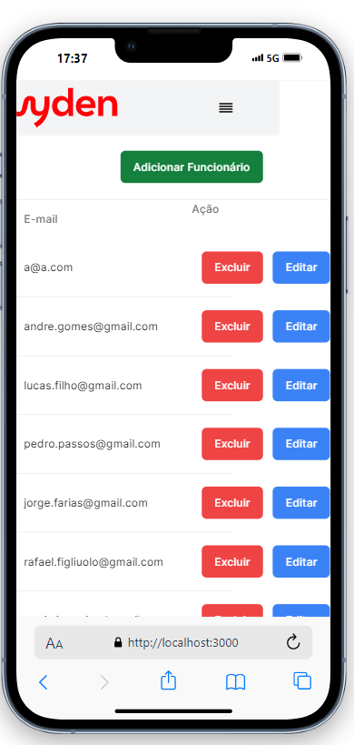
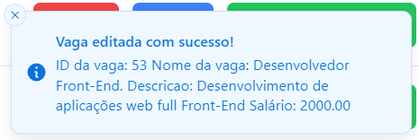

# Avaliação NF PBL: POO Java - Aplicação Web ou Mobile
Rafael Figliuolo Nascimento

## UniRuy | Wyden

## Disciplina
Programação Orientada a Objetos em Java

## Modelo da Aplicação
Para o desenvolvimento do projeto, optei por criar uma aplicação web, com o back-end desenvolvido em java

# Conteúdos Primários

## Introdução
Esta aplicação web foi desenvolvida para gerenciar processos de Talent Acquisition, utilizando tecnologias modernas que garantem desempenho, segurança e facilidade de uso. Seu objetivo é ajudar empresas a acompanhar a performance dos funcionários e centralizar o cadastro e armazenamento de informações sobre vagas e candidatos.

### Tecnologias Utilizadas
A aplicação foi desenvolvida com a seguinte stack tecnológica:

#### Front-end
- [Next.js](https://nextjs.org/): Um framework React que oferece uma experiência de desenvolvimento otimizada, com funcionalidades como renderização no lado do servidor e geração estática de páginas.
- [Tailwind CSS](https://tailwindcss.com/): Um framework utilitário que facilita a criação de interfaces responsivas e personalizáveis.
- [Shadcn](https://ui.shadcn.com/): Componentes integrados que proporcionam uma interface de usuário coesa e moderna.
- [Prettier](https://prettier.io/): Uma ferramenta de formatação de código que garante um estilo consistente e legível em todo o projeto, facilitando a manutenção e a colaboração entre desenvolvedores.
#### Back-end
- Java: Uma linguagem robusta e amplamente utilizada para o desenvolvimento de aplicações de alta performance e escalabilidade.
- Dependências do Projeto Java
    - Spring Boot Starter Data JPA: Facilita a implementação de repositórios baseados em JPA.
    - Spring Boot Starter Thymeleaf: Integração com o motor de templates Thymeleaf.
    - Spring Boot Starter Web: Necessário para a criação de aplicações web, incluindo RESTful APIs.
    - Spring Boot DevTools: Ferramentas de desenvolvimento, incluindo reinicialização automática.
    - Spring Boot Starter Test: Fornece ferramentas para testar a aplicação.
    - javax.persistence-api: API para gerenciar persistência de dados.
    - Spring Boot Starter Validation: Suporte para validação de dados.
    - PostgreSQL: Driver JDBC para conectar ao banco de dados PostgreSQL.
    - JJWT (Java JWT): Bibliotecas para criação e validação de JSON Web Tokens (JWTs).

#### Banco de Dados
- [PostgreSQL](https://www.postgresql.org/), um sistema de gerenciamento de banco de dados relacional avançado, conhecido por sua robustez e conformidade com os padrões SQL.

## Getting Started
Clone este repositório utilizando a seguinte URL: 

```bash
$ git clone https://github.com/RafaelFN1230/NF_Java.git
```

### Front-End
Para executar o front-end da aplicação, navegue até a pasta "Front_end", instale todas as dependências e então execute o comando para iniciar a aplicação.
```bash
$ cd Front_end
$ npm install
$ npm run dev
```

Abra [http://localhost:3000](http://localhost:3000) para ver sua aplicação.

Para que a aplicação funcione o front end deve estar hospedado na porta 3000
### Back-End
#### Pré-requisitos
- Certifique-se de ter os seguintes softwares instalados em seu sistema:
    * Java Development Kit (JDK) 11 ou superior: [Baixar JDK](https://www.oracle.com/java/technologies/downloads/#java11)
    * Apache Maven: [Instalação do Maven](https://maven.apache.org/install.html)
    * PostgreSQL: [Instalação do PostgreSQL](https://www.postgresql.org/download/)

- Configurar o arquivo application.properties
    * No diretório Back_end\src\main\resources\application.properties, edite o arquivo application.properties para configurar a conexão com o banco de dados conforme abaixo:
```JAVA
spring.application.name=Web_NF_POOJava
spring.datasource.url=jdbc:postgresql://localhost/JavaNF
spring.datasource.username=SEU_USUARIO
spring.datasource.password=SUA_SENHA
spring.datasource.driver-class-name=org.postgresql.Driver
hibernate.dialect=org.hibernate.dialect.HSQLDialect

spring.jpa.hibernate.ddl-auto=update
spring.jpa.show-sql=true
spring.jpa.format-sql=true
```

#### Run Application
- Para executar o Back end da aplicação vá para o arquivo Back_end\src\main\java\com\Web_NF_POOJava\Web_NF_POOJava\WebNfPooJavaApplication.java e rode a aplicação.
- Certifique-se de que a porta 8080 esteja livre.

## Objetivos da Aplicação
Esta aplicação tem como objetivo ajudar uma empresa de talent aquisition acompanhar a perfomace de seus funcionarios e centralizar o cadastro e armazenamento de informações de vagas e candidatos.

## Funções/Lista de Eventos (Funcionalidades)
[x] Logar.
[x] Criar e Armazenar user id nos cookies.
[x] Demonstrar informações de maneira coesa e concisa (Dashboard)
[x] Cadastrar Usuário.
[x] Cadastrar Vaga.
[x] Cadastrar Candidato.
[x] Editar Usuário.
[x] Editar Vaga.
[x] Editar Candidato.
[x] Deletar Usuário.
[x] Deletar Vaga.
[x] Deletar Candidato.

### Especificação de Programas

#### Layout da Tela;
As telas são primariamentes compostas por um header e um body, o header possui o logo da universidade e um incone para abrir o menu de navegação.

#### Regras de Negócio;
1. Autenticação e Sessão
    * O usuário deve logar com um único email e senha, não pode haver duplicidade de e-mail.
    * A sessão do usuário deve persistir por um longo período sem necessidade de relogin.
    * As senhas dos usuários não precisam ser armazenadas de forma segura, pois a aplicação será executada localmente. Em caso de esquecimento, as senhas podem ser consultadas diretamente no banco de dados.

2. Gerenciamento de Usuários
    * Um usuário pode adicionar e excluir outros usuários, mas só pode editar o nome dos usuários.
    * O email e a senha de um usuário não podem ser alterados após a criação.
    * Não é permitido haver dois usuários com o mesmo email no sistema.

3. Gerenciamento de Vagas
    * Um usuário pode criar, editar e excluir somente as vagas que ele próprio cadastrou.
    * Vagas podem ter nomes, descrições e salários repetidos.
    * Cada vaga deve ter um ID único para identificação.
    * As vagas serão referidas através do seu ID.

4. Gerenciamento de Candidatos
    * Um candidato pode ser associado a apenas uma vaga.
    * O funcionário pode editar o nome, email e resumo de um candidato, mas o RG não pode ser alterado.
    * O funcionário pode excluir candidatos.

5. Execução Local
    * A aplicação será executada apenas localmente.

#### Entidades Envolvidas (Classes) / Tabelas
Esta aplicação possui três entidades: Funcionario, vaga e Candidatos.

##### Funcionário
* Atributos:
    * long id (PK)
    * String nome
    * String data
    * String email
    * String senha
    * List< Vaga > vagas

##### Vaga
* Atributos:
    * Long id (PK)
    * String nome
    * String descricao
    * String salario
    * List< Candidato > candidatos

##### Candidato
* Atributos:
    * long id (PK)
    * String rg
    * String nomeCandidato
    * String resumoCurriculo
    * String email

## Requisitos Funcionais (RF)
1. Autenticação de Usuário
    * O usuário deve ser criado usando o nome completo, email e senha por qualquer outro usuário.
    * O usuário deve poder logar e deslogar usando email e senha.
    * Após logar, o usuário não deve precisar logar novamente por um longo período.

2. Gerenciamento de Usuários
    * Qualquer usuário pode adicionar e excluir usuários, mas só pode editar o nome dos usuários.
    * Quando adicionar um funcionário, deve ser coletado nome completo, email e senha.
    * Quando um usuário for adicionado, deve ser registrada a data de inserção no sistema.
    * Não pode haver dois usuários com o mesmo email.

3. Dashboard
    * Deve possuir um dashboard que acompanhe as vagas que possuem candidatos e as que não possuem, tanto no âmbito geral quanto separadas por funcionários.

4. Gerenciamento de Vagas
    * O usuário pode cadastrar uma vaga, que deve conter nome, salário e descrição.
    * Pode haver vagas com o mesmo nome, descrição e salário.
    * O usuário pode editar o nome, salário e descrição de uma vaga.
    * O usuário pode excluir uma vaga.
    * O usuário só pode ver, editar e excluir as vagas que ele cadastrou.
    * O usuário deve visualizar as informações da vaga em uma lista, incluindo o ID da vaga.

5. Gerenciamento de Candidatos
    * O usuário pode adicionar candidatos a uma vaga.
    * Para adicionar um candidato, deve ser coletado nome, RG, email e resumo do currículo.
    * Um candidato só pode ser cadastrado em uma vaga.
    * O funcionário deve poder ver quais candidatos estão cadastrados em cada vaga.
    * O funcionário pode editar o nome, email e resumo do currículo, mas não pode editar o RG.
    * O funcionário pode excluir um candidato.

## Requisitos Não Funcionais (RNF)
1. Segurança
    * As senhas dos usuários não precisam ser armazenadas de forma segura, pois a aplicação roda localmente e em caso de esquecimento, a senha pode ser consultada diretamente no banco de dados.
    * O sistema deve garantir que não haja usuários duplicados com o mesmo email.

2. Desempenho
    * O sistema deve suportar múltiplos usuários simultaneamente sem degradação significativa de desempenho.
    * O sistema deve garantir tempos de resposta adequados para operações comuns (cadastrar vagas, adicionar candidatos, etc.).

3. Usabilidade
    * A interface deve ser intuitiva e fácil de usar.
    * O dashboard deve fornecer uma visão clara e concisa das vagas e candidatos.

4. Persistência de Dados
    * O sistema deve garantir a integridade dos dados armazenados.
    * Todas as operações de CRUD (Create, Read, Update, Delete) devem ser devidamente tratadas para evitar inconsistências.

5. Manutenibilidade
    * O código deve ser bem documentado e seguir boas práticas de desenvolvimento.

## DER ou Diagrama de Classe

### Artefato gráfico
#### DER


## Aplicação
- [Link do Protótipo](https://www.figma.com/proto/dOWl6RKNlHzCSTeBZznAiR/NF-Java-Poo?type=design&node-id=1-2&t=a9hDKo7UeQvHPcte-1&scaling=contain&page-id=0%3A1&starting-point-node-id=1%3A2&mode=design)

### Menu/Submenu
A aplicação possui um menu lateral, onde o usuário poderá navegar pelo programa.
Este menu possui os itens Perfil, Dashboard, Vagas e Sign Out.

O menu possui dois estados, aberto e fechado.

#### Menu Fechado
_producao.PNG)
<br>

#### Menu Aberto
_producao.PNG)
<br>

### Telas Funcionais
- Responsividade: 
    - Devido a natureza da utilização desta aplicação, a sua responsividade foi trabalhanda tendo em mente diversas telas de computadores, porém a aplicação tambem funciona em mobile, apesar de não ser o foco da aplicação.
    - A apresentação das telas a seguir ira apresentar a tela em modo desktop e em seguida moblie, podendo possuir mais de uma imagem da mesma tela representando um scroll lateral.

- Componentes da Tela: 
    - Todas as telas possuem um header que contem o logo a esquerda e o menu de navegação a direita, portanto a apresentação das telas a seguir irao conter apenas a informação sobre o body da tela.


#### Login
- Objetivo da Tela:
    - Obter informações para que o usuário consiga logar na aplicação.
- Componentes da Tela:
    - Esta tela possui dois campos para que o usuário insira o seu e-mail e senha.
- Botões e Ações:
    - Esta tela possui um botão que ao ser precionado enviar os dados inseridos pelo usuário para o back end.
        
- Mensagens e Alertas:
    - Existe três alertas e um error que pode surgir nesta pagina
        - Alertas
            - E-mail Inválido: Ocorre quando o valor inserido não é o padrão de e-mail.
                
            - Favor Inserir Usuário: Ocorre quando não é inserido um valor.
                
            - Favor Inserir senha: Ocorre quando não é inserido um valor ou quando o valor inserido é menor do que 6 caracteres.
                
        - Error
            - E-mail ou Senha Inválida
                
- Fluxo de Navegação:
    - Ao chegar nesta tela o usuário deve inserir seu e-mail e senha, e clickar em "Entrar"
- Layout da Tela:
    - Desktop
        
    - Mobile
        

#### Dashboard
- Objetivo da Tela: 
    - Apresentar os dados de performace da equipe de maneira sucinta, coesa e direta.
- Componentes da Tela: 
    - O seu body possui três componentes principais:
        - Grafico Doughnut
            - Apresenta o número de vagas com e sem candidatos.
            - Posicionado na região superior esquerda da tela.
        - Card.
            - Apresenta o desempenho geral da equipe, demonstrando o número de vagas e candidadtos cadastradas.
            - Posicionado na região superior direita da tela.
        -Grafico de Barras e Linhas
            - Apresenta o total de candidatos, número de vagas com e sem candidatos, separado por funcionario.
            - Posicionado na região inferior da tela.
- Fluxo de Navegação:
    - Após o login o usuário é direcionado a esta tela, na qual ele pode efetuar uma analise dos dados, e/ou através do menu de navegação ele pode deslogar ou seguir para uma outra pagina da apliação.
- Layout da Tela: 
    - Desktop
        
    - Mobile
        

#### Perfil
- Objetivo da Tela:
    - Apresentar uma lista de funcionarios/perfis cadastrados, dando a opção do usuário editar ou excluir um perfil existente ou então adicionar um perfi novo.
- Componentes da Tela:
    - O seu body é composto por um botão na regiao superior a direita, o qual é responsavel pela adição de novos perfis, e uma tablea que contem id, nome completo e e-mail de cada perfil, além de dois botões responsaveis por editar e deletar um dado usuário. 
    - Ao clicar em Adicionar Funcionário um modal deve aparecer para que o usuário insira o nome completo, e-mail e senha do funcionário novo

- Botões:
    - Esta tela possui três botões principais:
        - Excluir
        
        - Editar
        
        - Adicionar Funcionário
        

- Mensagens e Alertas:
    - Esta tela possui quatro possiveis alertas:
        - Verde
        
        - Azul
        
        - Vermelho (Excluir)
        
        - Vermelho (Error)
        

- Exemplo de Uso:
    - Adicionar Funcionário
        - Ao chegar nesta tela o usuário vai clickar em "Adicionar Funcionário", em seguida preencher as informações e clickar em "Adicionar"
    - Editar
        - Ao chegar nesta tela o usuário vai clickar em "Editar", em seguida alterar o nome e clickar em "Editar"
    - Excluir
        - Ao chegar nesta tela o usuário vai clickar em "Excluir", em seguida clickar em "Comfirmar"

- Layout da Tela:
    - Desktop
        - Geral
            
        - Adicionar Perfil
            
        - Editar Perfil
            
        - Excluir Perfil
            
    - Mobile
        - Geral
            
            
        - Adicionar Perfil
            
        - Editar Perfil
            
        - Excluir Perfil
            


#### Vagas
- Objetivo da Tela:
    - O objetivo desta tela é cadastrar, editar, deletar e analisar vagas e candidatos
- Componentes da Tela:
    - O seu body é composto por um botão na regiao superior a direita, o qual é responsavel pela adição de novas vagas, e uma tabela que contem id, nome da vaga, descrição e salário de cada vaga, além de três botões responsaveis por adicionar um candidato, editar e deletar uma vaga. 
    - Ao clicar em "Adicionar Candidato" um modal deve aparecer para que o usuário insira o nome, rg, e-mail e resumo do currículo do candidato novo.
- Botões:
    - Esta tela possui quatro botões principais.
        - Excluir
        
        - Editar
        
        - Adicionar Candidato
        
        - Criar Vaga
        

- Mensagens e Alertas:
    - Esta tela possui quatro possiveis alertas:
        - Verde
        
        
        - Azul
        
        
        - Vermelho
        
        

- Exemplo de Uso:
    - Adicionar Vaga
        - Ao chegar nesta tela o usuário vai clickar em "Criar Vaga", em seguida preencher as informações e clickar em "Criar"
    - Editar
        - Ao chegar nesta tela o usuário vai clickar em "Editar", em seguida alterar as informações e clickar em "Editar"
    - Excluir
        - Ao chegar nesta tela o usuário vai clickar em "Excluir", em seguida clickar em "Comfirmar"

- Layout da Tela:
    - Desktop
        - Geral
        
        - Criar Vaga
        
        - Adicionar Candidato
        
        - Editar Vaga
        
        - Excluir Vaga  
        
        - Lista de Candidatos
        
        - Excluir Candidato
        
        - Editar Vaga
        

    - Mobile
        - Geral
        
        
        - Criar Vaga
        
        - Adicionar Candidato
        
        - Editar Vaga
        
        - Excluir Vaga  
        
        - Lista de Candidatos
        
        
        - Excluir Candidato
        
        - Editar Candidato
        


### Telas de Diálogo
Nesta aplicação foram utilizado telas de diálogo do tipo modal e non-modal.

#### Diálogos Modais
Diálogos modais bloqueiam a interação com o conteúdo subjacente da página até que o usuário tome a ação no diálogo. Eles são usados para garantir que o usuário responda a uma solicitação antes de continuar.
- Nesta aplicação as diálogos modais foram utilizadas nas seguintes funções/eventos.
    - Cadastrar Usuário.
    
    - Cadastrar Vaga.
    
    - Cadastrar Candidato.
    
    - Editar Usuário.
    
    - Editar Vaga.
    
    - Editar Candidato.
    
    - Listar Candidato.
    
    - Deletar Usuário.
    
    - Deletar Vaga.
    
    - Deletar Candidato.
    


#### Diálogos Non-Modais
Diálogos non-modais permitem que o usuário interaja com outras partes da página enquanto o diálogo está aberto. São utilizados como um meio de fornecer informações para o usuário, sem interromper seu o fluxo principal.
- Nesta aplicação os dialogos non-modais são utilizados quando o usuário faz alguma ação que acarreta em uma alteração do banco de dados, seja ela adicionar, editar ou remover um dado. Para isto utilizo componente [Toast](https://sonner.emilkowal.ski/toast) com uma cor diferente para cada tipo de ação que o usuário teve:
    - Verde: Quando um dado é adicionado ao banco.
        - Cadastrar Usuário.
        - Cadastrar Vaga.
        - Cadastrar Candidato.

    - Azul: Quando um dado é editado do banco.
        - Editar Usuário.
        - Editar Vaga.
        - Editar Candidato.


    - Vermelho: Quando um dado é removido do banco.
        - Deletar Usuário.
        - Deletar Vaga.
        - Deletar Candidato.


### Layout Relatórios
O relatório de minha aplicação esta sendo demonstrado através do dashboard que apresenta os seguintes dados:
- Número de vagas com e sem candidatos cadastrado.
- Número de vagas cadastradas no sistema
- Número de candidatos cadastrados no sistema
- Total de candidatos cadastrados, número de vagas com e sem candidatos separado por funcionario.
<br> 


# Considerações Finais
A conclusão deste projeto marca o desenvolvimento de uma aplicação web robusta e eficiente para a gestão de processos de Talent Acquisition, utilizando uma stack tecnológica moderna e amplamente adotada. A combinação de um front-end dinâmico com Next.js e um back-end poderoso com Java e Spring Boot resultou em uma solução que não apenas atende aos requisitos funcionais propostos, mas também garante um desempenho satisfatório, segurança adequada para o contexto local e uma interface intuitiva e amigável.

Este projeto foi capaz de proporcionar vários aprendizados e aprimoramentos, dentre eles temos:

- Desenvolvimento Full-Stack: A experiência de trabalhar com ambas as extremidades da aplicação, front-end e back-end, ampliou a compreensão das melhores práticas e padrões de design em desenvolvimento de software.
- Configuração e Deploy de Aplicações: A configuração do ambiente de desenvolvimento, incluindo a instalação e configuração de PostgreSQL, JDK e Maven, bem como a gestão de dependências com npm e Spring Boot, consolidou o conhecimento em deploy de aplicações web.
- Uso de Frameworks e Ferramentas Modernas: Utilizar frameworks como Next.js, Spring Boot, Tailwind CSS e ferramentas como Prettier e JJWT reforçou a importância de adotar tecnologias modernas e eficientes para facilitar o desenvolvimento e a manutenção de aplicações.
- Gerenciamento de Projetos: A organização do projeto, incluindo o uso de boas práticas de documentação e versionamento no GitHub, foi essencial para manter a clareza e a coesão do código ao longo do desenvolvimento.

Em resumo, a conclusão deste projeto não apenas cumpre os objetivos estabelecidos, mas também abre portas para futuras melhorias e expansões, consolidando uma base sólida para um sistema de gestão de Talent Acquisition eficiente e moderno.

# [Endpoints Schemas](/SCHEMA.md)
